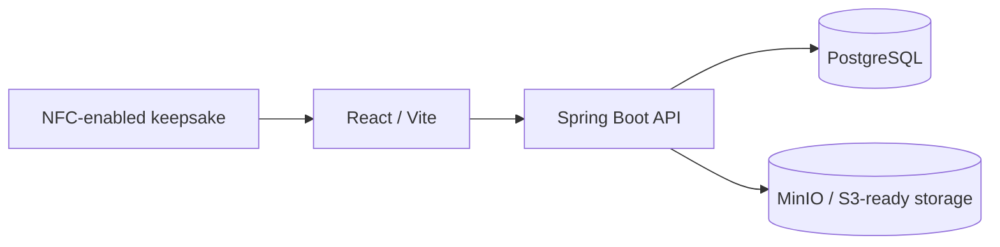

# WanderTrace

> **Every place leaves a trace.**

WanderTrace is a physical-to-digital travel memory platform: an NFC tag behind a keepsake can open a cinematic, public-safe journey in the browser.

## Core vertical slice
`/m/DEMO-PARIS-2026` resolves an NFC-style token through React, Spring Boot, PostgreSQL, and a Flyway-seeded Paris memory. It includes discovery, a cinematic hero, personal story, editorial gallery/lightbox, places, timeline, and closing.



## Run with Docker
```bash
cp .env.example .env
docker compose up --build
```
Open http://localhost:5173/m/DEMO-PARIS-2026, http://localhost:8080/actuator/health, and http://localhost:8080/swagger-ui/index.html.

## Local development
```bash
cd frontend && npm install && npm run dev
cd backend && mvn spring-boot:run
```
Start PostgreSQL separately with `.env` settings. Flyway creates and seeds schema automatically.

## Privacy & NFC
A tag contains only a URL such as `https://wandertrace.app/m/7F92K8A1`, never media or credentials. Public resolution returns only active tags with `PUBLIC` memories and records only count/time. Private, inactive, and unknown traces return the same 404.

For a physical tag: test a compatible NFC tag, assign the URL to a memory, write it to the tag, attach behind the magnet, and test on a phone. Metal magnets can reduce performance; use ferrite shielding where necessary.

## Scope and roadmap
Implemented: public-memory vertical slice, Flyway PostgreSQL schema, safe DTO boundary, indexes, CORS, health endpoint, Docker services, and cinematic responsive experience. Next: authenticated ownership APIs, admin CRUD, secure uploads, MinIO/S3 implementation, real maps, and full test coverage.
