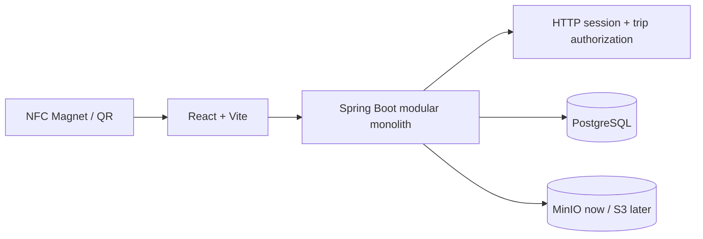

# WanderTrace

> **Every place leaves a trace.**

WanderTrace turns a physical travel keepsake into an intimate digital memory. An NFC tag contains only a public URL; the browser resolves it to a cinematic travel story without treating the token as a password.

## What is implemented

- **Public NFC experience** — `/m/DEMO-PARIS-2026` presents discovery, destination reveal, hero, story, responsive editorial gallery, places, timeline, and closing.
- **Secure public resolver** — active NFC tag + `PUBLIC` memory validation, DTO-only output, atomic scan count/timestamp update, and privacy-preserving 404s.
- **Sessions and identity** — registration, login, logout, and current-user API built around BCrypt hashes and rotated HTTP sessions.
- **Collaborative trips** — `OWNER`, `EDITOR`, and `VIEWER` membership is distinct from global application role. The backend resolves session identity then enforces trip membership in the service layer.
- **Data and infrastructure** — PostgreSQL/Flyway schema and Paris demo data, MinIO/Postgres/React/Spring Compose topology, CORS configuration, health, Swagger, CI foundation, and docs.

## Architecture



### Collaboration boundary

Every protected content request follows **session → trip membership → role → resource**. `OWNER` manages a trip and its collaborators; `EDITOR` manages content but not collaborators/trip deletion; `VIEWER` is read-only. No browser or collaborator receives database, MinIO, or AWS credentials. See [collaboration docs](docs/collaboration.md).

## Technology

React, TypeScript, Vite, React Router, Framer Motion, Axios, Lucide; Java 21, Spring Boot, Spring Security, JDBC/JPA infrastructure, Bean Validation, Flyway, PostgreSQL, Actuator, OpenAPI, Docker Compose, and MinIO.

## Local development

```bash
cp .env.example .env
# Start PostgreSQL (or use Compose) with the values in .env
cd backend && mvn spring-boot:run
cd frontend && npm install && npm run dev
```

Flyway creates the schema and demo France 2026 trip on startup. Development seed users include `admin@wandertrace.local` and `friend@wandertrace.local`; set/replace their credentials before using authentication flows because production credentials are never seeded as usable constants.

## Docker

```bash
cp .env.example .env
# set non-default POSTGRES_PASSWORD and S3_SECRET_KEY
docker compose up --build
```

- Web: http://localhost:5173
- Demo trace: http://localhost:5173/m/DEMO-PARIS-2026
- API/health: http://localhost:8080/actuator/health
- OpenAPI: http://localhost:8080/swagger-ui/index.html
- MinIO console: http://localhost:9001

## API surface

| Area | Endpoint examples |
|---|---|
| Public | `GET /api/public/memories/{token}` |
| Auth | `POST /api/auth/register`, `/login`, `/logout`; `GET /me` |
| Trips | `GET/POST /api/trips`, `GET/PUT/DELETE /api/trips/{id}` |
| Collaborators | `GET/POST /api/trips/{id}/members`, `PATCH/DELETE /api/trips/{id}/members/{userId}` |

All success responses follow `{ success, data, message }`; failures do not expose stack traces or persistence internals.

## NFC and media security

Write a URL like `https://wandertrace.app/m/7F92K8A1` to the tag—never photos, credentials, or database values. Test the tag before adhering it; metal magnets may require ferrite shielding. Public URLs are discoverable, so **only explicit `PUBLIC` memories** are returned.

Media binaries belong in MinIO/S3; PostgreSQL stores metadata only. The next storage slice will add generated object keys and type/size/extension validation at the upload boundary. See [storage docs](docs/storage.md).

## Verification and roadmap

CI installs/builds the frontend and runs backend tests with Node 20 and Java 21. The current environment blocked npm/Maven downloads with HTTP 403 and has no Docker daemon, so those checks must be re-run in a network-enabled development environment. The next focused slices are destination/memory CRUD, the storage provider implementation and secured upload, then dashboard/collaborator UI and integration tests.
