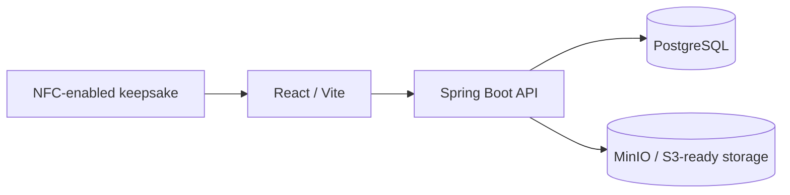

# WanderTrace

> **Every place leaves a trace.**

WanderTrace is a physical-to-digital travel memory platform: an NFC tag behind a keepsake can open a cinematic, public-safe journey in the browser.

## Core vertical slice
`/m/DEMO-PARIS-2026` resolves an NFC-style token through the React application, Spring Boot API, PostgreSQL, and Flyway-seeded Paris memory. It includes a discovery intro, hero, story, editorial gallery/lightbox, locations, timeline, and an intentional closing.



## Stack
React, TypeScript, Vite, React Router, Framer Motion, Axios, Java 21, Spring Boot, Spring Security, JDBC/JPA infrastructure, Flyway, PostgreSQL, OpenAPI, Actuator, Docker Compose, and MinIO.

## Run with Docker
```bash
cp .env.example .env
# Set non-default local passwords in .env
docker compose up --build
```
Open the [homepage](http://localhost:5173), [demo trace](http://localhost:5173/m/DEMO-PARIS-2026), [health endpoint](http://localhost:8080/actuator/health), Swagger at http://localhost:8080/swagger-ui/index.html, and MinIO console at http://localhost:9001.

## Local development
```bash
cd frontend && npm install && npm run dev
cd backend && mvn spring-boot:run
```
Start PostgreSQL separately using the settings in `.env`. Flyway creates and seeds the schema automatically.

## Privacy & NFC
A tag contains only a URL such as `https://wandertrace.app/m/7F92K8A1`, never media or credentials. Public resolution selects active NFC tags attached to `PUBLIC` memories and increments only a scan counter and timestamp. Private/inactive/unknown traces return an indistinguishable 404.

For a physical tag: test a compatible NFC tag, create/assign a memory and generated URL, write that URL to the tag, place it behind the magnet, and test on a phone. Metal magnets can reduce NFC read performance; use a ferrite shielding layer where necessary.

## Current scope and roadmap
The public-memory vertical slice, PostgreSQL schema, safe public DTO boundary, migration indexing, CORS configuration, health endpoint, Docker services, and visual experience are implemented. Authenticated ownership APIs, admin CRUD, secure uploads, MinIO/S3 implementation, real map provider, and CI test coverage are the recommended next vertical slices.
